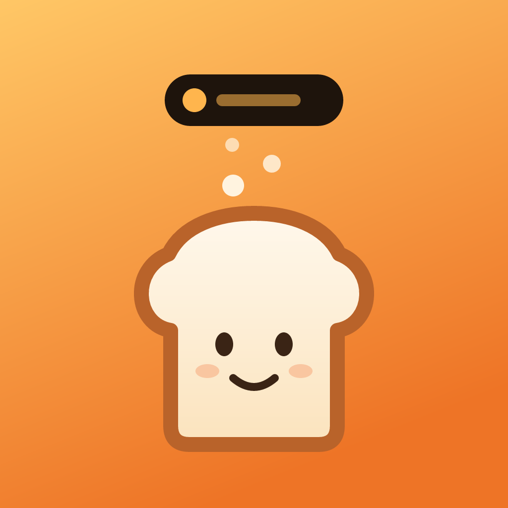

<p align="center">
  
</p>

<h1 align="center">Breadcrumb</h1>

<p align="center"><b>Walked into a room and forgot why? Never again.</b><br>
Say what you're about to do. It waits in your Dynamic Island until you've done it.</p>

---

## The problem nobody fixes

You walk into the kitchen and stand there. *Why did I come in here?*
You unlock your phone to check one thing, see a notification, and ten minutes later you can't remember what it was.

Everyone does this, every day. Psychologists call it the **doorway effect**: walking through a doorway makes your brain close one "scene" and open a new one, and the thought you were carrying gets filed away ([Radvansky et al., 2011](https://doi.org/10.1080/17470218.2011.571267)). It's worse when you're tired, stressed, or have ADHD, but it happens to all of us.

We treat it as a funny quirk of being human. Breadcrumb treats it as a bug with a two-second fix.

## How it works

1. **Drop a breadcrumb.** Tap the mic and say three words: *"grab the scissors"*. Breadcrumb stops listening on its own when you stop talking. You can also type it or tap a suggestion.
2. **Walk away.** Your breadcrumb lives in the **Dynamic Island** and on your **Lock Screen**, with an emoji so you can read it at a glance.
3. **Blank out? Glance up.** *✂️ Scissors.* Tap **Got it** right in the Island when you're done.

Faster ways to drop one, without even opening the app:

- **Action Button**: press it, say what you're doing, done.
- **Control Center or Lock Screen control**: opens straight into listening.
- **Siri**: "Drop a Breadcrumb".

## Features

| | Free | Pro |
|---|:---:|:---:|
| Voice and text breadcrumbs | ✓ | ✓ |
| Dynamic Island + Lock Screen Live Activity | ✓ | ✓ |
| Action Button, Control Center and Siri | ✓ | ✓ |
| Active breadcrumbs at once | 1 | **Trail of 3** |
| History | Last 7 days | **Everything** |
| Insights: what you forget most, when, how fast you recover | | ✓ |
| Island colors | Crust | **+ Blueberry, Matcha, Midnight** |

## Monetization with RevenueCat

The core fix stays free forever, because a memory aid people can't afford doesn't help anyone. Pro is for people who lean on Breadcrumb every day: busy parents, students, and people with ADHD.

- **Paywall:** built with **RevenueCatUI** `PaywallView`, configured remotely in the RevenueCat dashboard, so pricing and copy can be tested without an app update.
- **Entitlement:** a single `pro` entitlement unlocks everything. `ProStore` listens to `customerInfoStream`, so Pro turns on the instant a purchase finishes.
- **Packages:** monthly, annual, and lifetime. Utility apps convert best with a lifetime option, and it respects people who dislike subscriptions.
- **The paywall appears at natural moments** instead of on launch:
  - when a free user drops a second breadcrumb and the first one gets swapped out ("Pro keeps a trail of 3")
  - when they open Insights, which shows a blurred preview of their own patterns
  - when they pick a locked Island color
- **Works in the background:** App Intents (Action Button, Siri) run without the UI, so Pro status is cached locally and they can still respect it.
- **Development:** built against **RevenueCat Test Store**, so the full purchase flow works without an App Store Connect account. The build pipeline injects the key from a repository secret, and the SDK is only configured with a `test_` key in debug builds.

## Tech

- **SwiftUI** app for iOS 18+, no third-party UI code.
- **ActivityKit**: one Live Activity shows the whole trail, the newest breadcrumb up front (`CrumbStore.syncLiveActivity`).
- **App Intents**:
  - `LiveActivityIntent` powers the **Got it** button inside the Island.
  - `DropCrumbIntent` works from the Action Button and Siri without opening the app.
- **WidgetKit Controls** (iOS 18): a Control Center / Lock Screen button that opens the app already listening.
- **Speech framework**:
  - Recognition runs on-device when the phone supports it, so what you say never leaves your iPhone.
  - Listening ends automatically after a short silence.
- **Swift Charts** for Insights.
- **Private by design**: no account, no server. Breadcrumbs are stored in a local JSON file.

## Build it

### On a Mac

```bash
brew install xcodegen
xcodegen generate
open Breadcrumb.xcodeproj
```

To test purchases, add your RevenueCat Test Store key (it starts with `test_`) as the `REVENUECAT_API_KEY` build setting. Without a key the app still runs; purchases are just turned off.

### Without a Mac (how this app was built)

1. Push to GitHub. The workflow in `.github/workflows/build.yml` builds an unsigned `.ipa` on a GitHub-hosted Mac.
2. Add your Test Store key as a repository secret named `REVENUECAT_TEST_KEY`.
3. Download the `Breadcrumb-ipa` artifact from the workflow run.
4. Install it on your iPhone with [Sideloadly](https://sideloadly.io/) and a free Apple ID. Enable Developer Mode on the iPhone when asked.

## Project layout

```
App/        SwiftUI app: model, speech, RevenueCat, screens, App Intents
Widgets/    Live Activity (Dynamic Island + Lock Screen) and the Control Center control
Shared/     Types and intents used by both the app and the widget extension
design/     Source SVG for the app icon
```

## License

[MIT](LICENSE)
